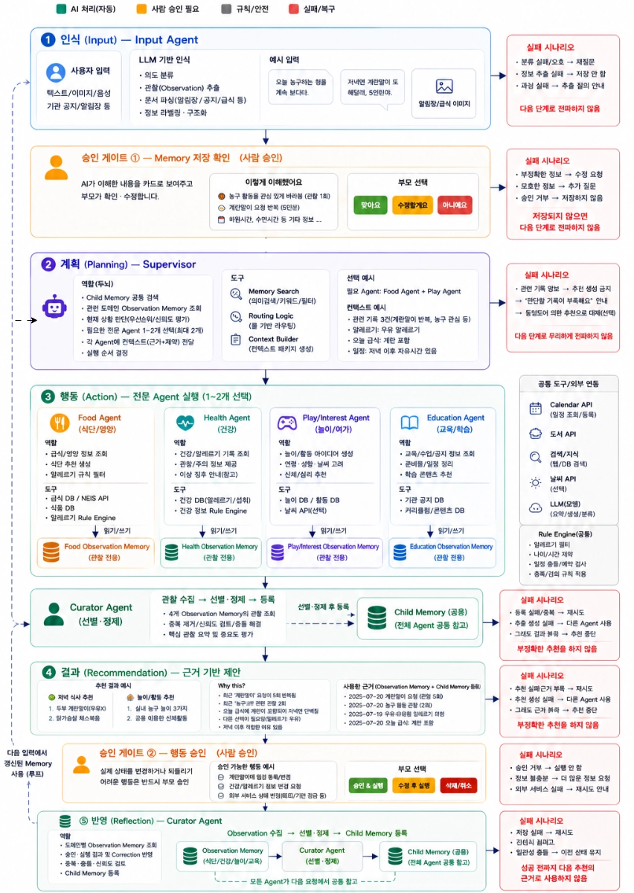

# 테크스펙

<aside>
💡

1. 노란색을 제외한 요소들은 선택사항입니다.
2. 핵심요소라고 해서 무조건 작성하는 것은 아닙니다.
3. 다른 요소를 추가하셔도 됩니다.
</aside>

# 배경

<aside>
💡

왜 이 기능을 만드는지, 어떤 사용자 문제를 해결하려 하는지 등

</aside>

### 왜 만드는가

아이에 관한 정보가 키즈노트·카카오톡·캘린더·사진첩·병원 기록에 흩어져 있고, 새로운 상황이 생길 때마다 부모가 이를 **직접 찾아 → 연결하고 → 무엇이 지금 중요한지 판단한 뒤 → 다음 행동까지 결정**해야 한다. 범용 AI를 써도 질문할 때마다 아이의 나이·취향·과거 반응을 다시 설명해야 해서 노동이 줄지 않는다.

### 사용자 문제 (한 문장)

> 일과 육아를 병행하는 양육자는 알림장·일정·식사·행동·과거 경험 등 흩어진 정보를 매번 직접 연결하고 판단해야 하는 **반복적인 육아 인지 노동**에 시달린다.
> 

# 목표

<aside>
💡

예상 가능한 결과들

</aside>

### 제품 목표

부모가 별도로 정리하지 않아도 AI가 Child Memory를 만들고, 그 기억을 근거로 **식사·놀이·교육·건강** 네 영역에서 "지금 우리 아이에게 맞는 다음 행동"을 준비해 **확인·선택 몇 번**으로 줄인다.

### 성공 정의 (한 문장)

> Agent가 **실제 Child Memory를 근거로 판단했을 때**의 보호자 채택률.
> 

### 세부 지표

| 지표 | 정의 | 목표값 |
| --- | --- | --- |
| eval 통과 수 | 자체 테스트 10개 중 통과 수 | 9/10 이상 |
| 비교 선택률 | 동일 질문에 대해 범용 LLM 답 vs 우리 답 블라인드 비교 시 우리 답 선택 비율 | 80%  |
| 오근거 사용률 | 잘못되었거나 6개월 이상 지난 기억을 단독 근거로 사용한 비율 | 0에 가깝게 |
| 실행 전환율 | 승인된 제안 중 24시간 내 실제 행동이 확인된 비율 | 70% 이상 |
| 재방문율 | 전체 사용자의 주간 접속 일수를 기준으로 산출한 평균 접속 비율 | 80% |

# 일정

<aside>
💡

프로젝트 시작부터, 기획, 디자인, 개발, QA, 릴리즈 일정 등 모든 일정

</aside>

| 시기 | 제거할 불확실성 / 핵심 목표 | 확인 방법 |
| --- | --- | --- |
| ~9월 1주 | ⭐ **Child Memory가 믿을 수 있는 형태로 만들어지는가** + 외부 데이터가 실제로 붙는가 | 대표 입력 30건에 사람이 정답 라벨링 → AI 결과와 비교. **과해석 / 주체 혼동 / 근거 없는 Memory 생성**을 별도 집계. 나이스 급식 API, 공지 OCR, Calendar 승인 쓰기 동작 확인 |
| 9월 2~4주 | 핵심 구조 확정 | Memory 스키마, Agent Workflow, API Schema, 핵심 UI 확정 (→ 본 문서 §7·§8 확정 시점) |
| 10월 1~2주 | Supervisor 라우팅 + End-to-End | 기록형·요청형·혼합형 입력 각각 테스트. 대표 시나리오 처음부터 끝까지 실행 |
| 10월 3주 | **1차 배포** | 실제 학부모에게 공개, 핵심 시나리오 사용 가능 상태 |
| 10월 3주~11월 초 | 실사용 데이터 축적 | 발화·Memory 생성/수정·Correction·추천 선택/거절 로그 수집 |
| 11월 1~2주 | **Memory가 실제로 답변 품질을 올리는가** | 같은 질문을 Memory 있음/없음으로 A/B. Correction이 다음 추천에 반영되는지 확인. 승격·감쇠 기준 조정 |
| 11월 3주 | **새 기능 금지** — 통합·안정화 | eval 전체 실행, Edge Case, 보안 리뷰, 실패 화면 확인, 최종 데모 리허설 |

# 담당

<aside>
💡

프로젝트를 담당하고 있는 모든 인원

</aside>

| **이름** | **팀 역할** | **프로젝트 역할** | **소유하는 것** |
| --- | --- | --- | --- |
| 박재형 | PM | 백엔드 / 프론트 / AI | CLAUDE.md, 문제 한 문장, 수렴 최종 결정권 |
| 고태영 | 프론트 리드 | 프론트 | 화면 구현 |
| 김명성 | 백엔드 리드 | 백엔드 | 통합·머지 |
| 이시하 | AI 리드 | AI | Agent 구현 |
| 오현식 | 메이커 | 백엔드 / AI | `eval/`, 테스트 케이스 |
| 이도헌 | 플래너 | AI / 백엔드 | `eval/`, 믿을 수 있는 숫자 |

### 의사결정 원칙

- 개인 구현 방식 → 작업자 자율
- 기능 내부 기술 결정 → 해당 기능 Owner
- 영역 간 인터페이스 → 관련 Owner 협의
- 서비스 핵심 정책 → 팀 전체 근거기반 탈락 방식 논의 후 **PM 최종 결정**

# 요구사항

<aside>
💡

기능적, 비기능적 요구사항으로 나누어 생각

</aside>

### 5-1. 기능적 요구사항

| **ID** | **요구사항** |
| --- | --- |
| F-01 | **Memory Agent** — 부모 자연어 입력을 구조화해 Child Memory / Observation Memory에 저장 |
| F-02 | **Fact / Observation / Inference 3분류** — 부모 발화는 `caregiver_observation`(아이의 fact로 승격 금지) |
| F-03 | **Curator** — 여러 출처의 같은 관찰 병합, 반복 횟수 집계, 관찰 → 성향/관심 승격 |
| F-04 | **Child Supervisor** — 안전 사전검사(규칙) + 의도 분류(기록형/요청형/혼합형) + Agent 최대 2개 라우팅 |
| F-05 | **Food Agent** — 실제 섭취·선호·기관 급식·최근 상황 반영한 식사 아이디어 |
| F-06 | **Activity Agent** — 최근 행동·관심·몰입 기반 놀이·여가 추천 |
| F-07 | **Education Agent** — 기관 공지 구조화, 준비물·Action 추출 |
| F-08 | **Health Agent** — 건강 기록 정리, 검진일·복약 알림, 진료 시 전달 정보 보조 |
| F-09 | **근거 표시** — 모든 추천에 사용한 memory_id 첨부 + `Why this / Why now / Evidence` 표시 |
| F-10 | **Correction UI** — `맞아요 / 한 번 본 것뿐 / 지금은 달라요 / 잘못된 기록` 4버튼, 누르면 즉시 재계산 |
| F-11 | **승인 게이트** — 되돌릴 수 없는 2곳(캘린더 쓰기 / 건강·알레르기 기록 확정)에만 사람 승인 |
| F-12 | **기록 부족 처리** — 근거 0건이면 추천을 만들지 않고 "기록이 부족해요" + 최소 질문 1개 |
| F-13 | **첫 진입 온보딩** — 이름(혹은 별명)·나이·**알레르기 여부**만 수집 (그 외 프로필 질문 없음) |
| F-14 | 기관 공지 붙여넣기 / 이미지 OCR 입력 |
| F-15 | 시간대별 예상 질문 버튼 제공 (예: 저녁 6시 → "민준이랑 먹을 저녁 추천해줘") |

### 5-2. 비기능적 요구사항

| **ID** | **요구사항** | **근거** |
| --- | --- | --- |
| NF-01 | **모델 호출 최소 1회 · 최대 3회** (Supervisor 1 + 도메인 Agent 최대 2) | 비용·지연 상한 |
| NF-02 | 날짜·나이 계산, 일정 충돌, **알레르기·금지식품 필터**, Memory 감쇠, 반복 승격은 **코드 규칙**으로 처리. (모델이 판단하지 않음) | 정확해야 하는 칸 |
| NF-03 | 알레르기·검진 정보는 **LLM이 생성·추론·수정 금지**. 보호자 입력값 또는 의료 기록만 신뢰 | 안전 |
| NF-04 | 개인정보 최소 수집 — 나이·알레르기 여부만. 보관 범위·기간은 `[미정 — 9월 2주 확정]`  | 개인정보 |
| NF-05 | 로그에 원문 대신 `memory_id`를 남긴다 | 민감정보 유출 방지 |
| NF-06 | 응답 20초 초과 시 **부분 결과로 전환** (Agent 2개 중 1개만 성공해도 그 화면을 보여줌) | UX |
| NF-07 | 승인 없는 draft는 **24시간 뒤 만료**. 자동 실행 경로는 코드에 존재하지 않음 | 안전 |
| NF-08 | 6개월 이상 지난 관심 기록은 **단독 근거로 사용 금지** | 정확성 |
| NF-09 | `.env` gitignore / 프론트에 API 키 없음 / 인증 없는 엔드포인트 없음 / DB 접근 규칙 ON | 보안 |

# 아키텍처 설계

<aside>
💡

전체적인 구조와 흐름 등을 도식화

</aside>

- 아이디어톤에서 적었던 내용
- 3. 기술 스택·도구
    
    ## 3. 기술 스택·도구
    
    ### Frontend
    
    - Next.js / React (웹)
    - React Native (모바일 - 웹뷰 방식)
    - TypeScript
    - Tailwind CSS
    - Zustand
    - TanStack Query
    
    ### Backend
    
    - Python / FastAPI
    - PostgreSQL + pgvector
    - REST API
    - Docker
    
    ### AI / Agent
    
    - LLM API
    - Structured Output
    - Tool Calling
    - Embedding / Vector Search
    - Supervisor + Domain Agent
    - Memory Curator
    
    > Memory의 승격·강등·감쇠는 반복 횟수·시간·Correction 등의 명시적인 기준을 **코드와 규칙으로 처리**하고, LLM은 자연어 이해·구조화·추천 후보 생성 등에 집중한다.
    > 
    
    ### AI 개발 및 프로토타이핑 도구
    
    - Claude Code, Codex, Antigravity — Agent 구현, 코드 생성·수정 및 개발 보조
    - Claude Design — UI/UX 아이디어 및 프로토타입 설계 보조
    - Prompt / Agent Workflow 문서화 및 버전 관리
    
    ### 개발·협업
    
    - Git / GitHub
    - Notion — 기획 및 의사결정 기록, API / Agent 명세, Memory 정책 문서
    - Discord 또는 Slack — 실시간 커뮤니케이션
    - VS Code — 통합 개발 환경
    - Orca — Agent 개발 및 작업 흐름 보조
    - Figma / Claude Design

> ⚠️ 원본 `부산대3팀_아키텍처.png` 는 Notion export 에 포함되지 않았습니다. 현재 저장소에 있는 가장 가까운 도식은 아래 Agent 처리 흐름도입니다.



# 데이터 모델(수정중)

<aside>
💡

필요한 DB구조, 필드 정의 등

</aside>

[A Free Database Designer for Developers and Analysts](https://dbdiagram.io/home)

- DBML
    
    ```jsx
    // =====================================================================
    // 육아 에이전트 스키마 (dbdiagram.io 용 DBML)
    //  - 실선 Ref = DB가 강제하는 진짜 FK
    //  - {kind,id} soft ref 는 jsonb 컬럼 + Note 로만 표현 (Ref 안 검)
    //  - [FIX] = 지금 그대로면 깨지는 버그, 반영함
    //  - [OPEN] = 팀 결정 필요, 원안 유지 + 주석
    // =====================================================================
    
    // ---------------------------- ENUMS ----------------------------------
    Enum parent_child_status {
      pending
      approved
      owner
    }
    
    Enum obs_status {
      active
      uncertain
      expired
    }
    
    Enum obs_source_type {
      parent_note
      institution_notice
      agent_infer
    }
    
    Enum food_amount {
      half_bowl
      finished
      leftover
    }
    
    Enum food_reaction {
      liked
      disliked
      neutral
    }
    
    Enum health_severity {
      mild
      moderate
      severe
      emergency
    }
    
    Enum edu_engagement {
      low
      mid
      high
    }
    
    Enum interest_state {
      observed
      candidate
      confirmed
      archived
    }
    
    Enum pref_valence {
      like
      dislike
      neutral
    }
    
    Enum pref_state {
      active
      dormant
      archived
    }
    
    Enum safety_kind {
      allergy
      chronic_disease
      dietary_restriction
      behavioral
      environmental
      other_medical
    }
    
    Enum safety_severity {
      mild
      moderate
      severe
      anaphylaxis
    }
    
    Enum safety_state {
      active
      retracted
    }
    
    Enum suggestion_agent {
      food
      activity
      education
      health
    }
    
    Enum suggestion_status {
      draft
      approved
      rejected
      expired
    }
    
    Enum correction_verdict {
      confirm
      once_only
      outdated
      wrong
    }
    
    Enum event_type {
      core
      episodic
    }
    
    Enum event_category {
      institution
      health
      activity
      etc
    }
    
    Enum event_status {
      draft
      confirmed
      cancelled
    }
    
    Enum event_created_by {
      agent
      caregiver
    }
    
    Enum reminder_channel {
      push
      in_app
    }
    // ---------------------------- IDENTITY -------------------------------
    Table parent {
      id         uuid [pk]
      kakao_id   bigint [not null, unique, note: 'FIX: 카카오 회원번호는 uuid가 아니라 숫자(bigint)']
      created_at timestamptz [default: `now()`]
    }
    
    Table parent_child {
      parent_id uuid [not null]
      child_id  uuid [not null]
      relation  varchar
      status    parent_child_status [not null, default: 'pending']
    
      indexes {
        (parent_id, child_id) [pk]  // FIX: 원안엔 PK/UNIQUE 없어 중복 row 방지 불가
      }
    }
    
    Table child {
      id         uuid [pk]
      name       text
      birth_date date [note: '나이는 계산, 저장 X']
      created_at timestamptz [default: `now()`]
    }
    
    // ==================== OBSERVATION (episodic) =========================
    // [OPEN] 4개 물리 테이블 분리 -> 공통컬럼 4x 중복 + polymorphic soft ref 강제.
    //        단일 observation(domain, payload jsonb) 통합 시 진짜 FK 하나로 정리됨.
    
    Table observation_food {
      id               uuid [pk]
      child_id         uuid [not null]
      raw_text         text [not null]
      embedding        vector1536 [note: 'pgvector, HNSW']
      interest_key     text
      aliases          text_array
      strong_signals   text_array
      support_signals  text_array
      observed_on      date [not null]
      observed_at      timestamptz [default: `now()`]
      confidence       real [default: 0.5, note: 'CHECK 0.0~1.0']
      status           obs_status [default: 'active']
      source_type      obs_source_type [not null]
      source_notice_id uuid
      // food 고유
      subject  text [not null]
      action   text
      amount   food_amount
      reaction food_reaction
      meta     jsonb [default: `'{}'`]
      created_at timestamptz [default: `now()`]
      updated_at timestamptz [default: `now()`]
    
      indexes {
        (child_id, observed_on) [note: 'WHERE status=active']
        (child_id, interest_key, observed_on) [note: 'WHERE status=active']
      }
    }
    
    Table observation_health {
      id               uuid [pk]
      child_id         uuid [not null]
      raw_text         text [not null]
      // health 는 embedding 제외
      interest_key     text
      aliases          text_array
      strong_signals   text_array
      support_signals  text_array
      observed_on      date [not null]
      observed_at      timestamptz [default: `now()`]
      confidence       real [default: 0.5]
      status           obs_status [default: 'active']
      source_type      obs_source_type [not null]
      source_notice_id uuid
      // health 고유
      symptom           text [not null]
      severity          health_severity
      body_part         text
      duration_hours    int
      suspected_trigger text [note: '값 있으면 Curator가 profile_safety 승인대기 후보 생성']
      action_taken      text
      meta              jsonb [default: `'{}'`]
      created_at timestamptz [default: `now()`]
      updated_at timestamptz [default: `now()`]
    }
    
    Table observation_education {
      id               uuid [pk]
      child_id         uuid [not null]
      raw_text         text [not null]
      embedding        vector1536
      interest_key     text
      aliases          text_array
      strong_signals   text_array
      support_signals  text_array
      observed_on      date [not null]
      observed_at      timestamptz [default: `now()`]
      confidence       real [default: 0.5]
      status           obs_status [default: 'active']
      source_type      obs_source_type [not null]
      source_notice_id uuid
      // education 고유
      topic            text [not null]
      session_type     text
      duration_min     int
      engagement_level edu_engagement
      outcome          text
      meta             jsonb [default: `'{}'`]
      created_at timestamptz [default: `now()`]
      updated_at timestamptz [default: `now()`]
    }
    
    Table observation_activity {
      id               uuid [pk]
      child_id         uuid [not null]
      raw_text         text [not null]
      embedding        vector1536
      interest_key     text
      aliases          text_array
      strong_signals   text_array
      support_signals  text_array
      observed_on      date [not null]
      observed_at      timestamptz [default: `now()`]
      confidence       real [default: 0.5]
      status           obs_status [default: 'active']
      source_type      obs_source_type [not null]
      source_notice_id uuid
      // activity 고유
      activity         text [not null]
      location         text
      companions       text
      duration_min     int
      engagement_level edu_engagement
      meta             jsonb [default: `'{}'`]
      created_at timestamptz [default: `now()`]
      updated_at timestamptz [default: `now()`]
    }
    
    // ==================== PROFILE (semantic) ============================
    
    Table profile_interest {
      id                  uuid [pk]
      child_id            uuid [not null]
      key                 text [not null]
      aliases             text_array
      domains             text_array [not null, note: 'food/activity/education/health']
      distinct_days_14d   int [default: 0]
      strong_signals_14d  text_array
      has_strong_signal   boolean [note: 'FIX: GENERATED AS (cardinality(strong_signals_14d) > 0). 원안 array_length()는 빈배열에서 NULL 반환']
      state               interest_state [default: 'observed']
      confidence          real [default: 0.5]
      first_observed_on   date [not null]
      last_observed_on    date [not null]
      promoted_at         timestamptz
      state_recomputed_at timestamptz [default: `now()`]
      source_refs         jsonb [default: `'[]'`, note: 'SOFT ref [{kind,id}] -> observation_*. DB FK 아님, 앱 무결성 책임']
      created_at timestamptz [default: `now()`]
      updated_at timestamptz [default: `now()`]
    
      indexes {
        (child_id, key) [unique]
        (child_id, state)
        (child_id, last_observed_on)
      }
    }
    
    Table profile_preference {
      id                uuid [pk]
      child_id          uuid [not null]
      key               text [not null]
      aliases           text_array
      domains           text_array [not null, note: 'OPEN: 아래 UNIQUE가 참조하는 domain(단수) 컬럼이 없음. 단수 스칼라로 바꿀지 결정 필요']
      valence           pref_valence [not null]
      strength          real [default: 0.3]
      confidence        real [default: 0.4]
      first_observed_on date [not null]
      last_observed_on  date [not null]
      observation_count int [default: 1]
      source_refs       jsonb [default: `'[]'`, note: 'SOFT ref [{kind,id}]']
      state             pref_state [default: 'active']
      created_at timestamptz [default: `now()`]
      updated_at timestamptz [default: `now()`]
    
      indexes {
        (child_id, key) [unique, note: 'OPEN: 원안 UNIQUE(child_id, domain, key)의 domain 컬럼 부재. 임시로 (child_id,key)']
      }
    }
    
    Table profile_safety {
      id         uuid [pk]
      child_id   uuid [not null]
      kind       safety_kind [not null]
      label      text [not null]
      aliases    text_array
      category   varchar [note: 'kind별 하위분류']
      severity   safety_severity
      reactions  text_array
      management jsonb [default: `'{}'`]
      notes      text
      created_by uuid [not null]
      updated_by uuid
      state      safety_state [default: 'active', note: '감쇠 없음. 보호자만 retracted 전환']
      created_at timestamptz [default: `now()`]
      updated_at timestamptz [default: `now()`]
    
      indexes {
        (child_id, kind, label) [unique]
      }
      Note: 'AUTHORITATIVE 알레르기/만성질환 소스. Agent/Curator role write 권한 미부여'
    }
    
    // ==================== ACTIONS / OUTPUT ==============================
    
    Table suggestion {
      id         uuid [pk]
      child_id   uuid [not null]
      memory_refs jsonb [note: 'FIX: 원안 memory_id(단수) -> memory_refs. SOFT ref [{kind,id}]']
      agent      suggestion_agent
      content    text
      why_this   text
      why_now    text
      status     suggestion_status
      expires_at timestamptz [note: '생성 +24h']
      created_at timestamptz [default: `now()`, note: 'FIX: 원안 누락']
    }
    
    Table correction {
      id          uuid [pk]
      child_id    uuid [note: 'FIX: 원안 누락. 아이별 정정이력 조회/데이터해자 위해 추가 권장']
      memory_refs jsonb [note: 'FIX: 단일객체 -> 배열 통일 권장. SOFT ref [{kind,id}]']
      verdict     correction_verdict
      created_at  timestamptz [default: `now()`]
    }
    
    // ==================== CALENDAR / EVENT ==============================
    
    Table calendar {
      id       uuid [pk]
      child_id uuid [not null]
      date     date
      image_urls text_array [note: 'nullable']
      text     text [note: '일기']
      event_ids  jsonb [note: 'SOFT: episodic 이벤트만. 날짜쿼리로 파생 가능한지 재검토']
    }
    
    Table event {
      id                uuid [pk]
      child_id          uuid [not null]
      title             text
      event_type        event_type
      starts_at         timestamptz
      ends_at           timestamptz
      all_day           boolean
      category          event_category
      status            event_status [note: 'draft 24h 만료']
      created_by        event_created_by
      source_notice_id  uuid
      source_memory_ids jsonb [note: 'FIX: 원안 uuid[]는 kind 부재로 어느 observation인지 불명. [{kind,id}]로 통일 권장']
    }
    
    Table event_item {
      id          uuid [pk]
      event_id    uuid [not null]
      name        text
      is_prepared boolean [default: false]
      prepared_at timestamptz
    }
    
    Table reminder {
      id                    uuid [pk]
      event_id              uuid [not null]
      remind_at             timestamptz
      sent_at               timestamptz [note: '채워지면 되돌릴 수 없음']
      channel               reminder_channel
      approved_by_caregiver boolean [default: false, note: 'false면 발송 금지']
    }
    
    // ==================== 기타 ==========================================
    Table notice {
      id         uuid [pk]
      child_id   uuid
      raw_text   text
      ocr_result jsonb
      created_at timestamptz [default: `now()`]
    }
    
    Table health_record {
      id       uuid [pk]
      child_id uuid [not null]
      Note: 'DUP 주의: profile_safety(allergy)와 경계 명확히. 쓰기경로 = 승인 API 하나'
    }
    
    Table calendar_link {
      id       uuid [pk]
      child_id uuid
      Note: '우리가 만든 일정만 기록 (남의 일정 변경 금지 근거)'
    }
    
    // ==================== REAL FKs (실선) ===============================
    Ref: parent_child.parent_id > parent.id
    Ref: parent_child.child_id  > child.id
    
    Ref: observation_food.child_id       > child.id
    Ref: observation_health.child_id     > child.id
    Ref: observation_education.child_id  > child.id
    Ref: observation_activity.child_id   > child.id
    Ref: observation_food.source_notice_id      > notice.id
    Ref: observation_health.source_notice_id    > notice.id
    Ref: observation_education.source_notice_id > notice.id
    Ref: observation_activity.source_notice_id  > notice.id
    
    Ref: profile_interest.child_id   > child.id
    Ref: profile_preference.child_id > child.id
    Ref: profile_safety.child_id     > child.id
    Ref: profile_safety.created_by   > parent.id
    Ref: profile_safety.updated_by   > parent.id
    
    Ref: suggestion.child_id > child.id
    Ref: correction.child_id > child.id
    Ref: calendar.child_id   > child.id
    Ref: event.child_id      > child.id
    Ref: event.source_notice_id > notice.id
    Ref: event_item.event_id > event.id
    Ref: reminder.event_id   > event.id
    Ref: health_record.child_id > child.id
    Ref: notice.child_id > child.id
    
    // SOFT refs (source_refs / memory_refs / source_memory_ids / event_ids)
    // 는 의도적으로 Ref 미표기 — DB가 강제하지 않는 논리참조이기 때문.
    ```
    

### parent (실 사용자)

| **필드** | **타입** | **비고** |
| --- | --- | --- |
| id | uuid | PK |
| nickname | text | 표시 이름. 보호자 목록·이관 화면·기록 작성자 표시에 필요 |
| deleted_at | timestamptz | nullable. 계정 탈퇴 요청 시각, N일 후 파기 |
| created_at | timestamptz | default now() |

### auth_identity

| 필드 | 타입 | 비고 |
| --- | --- | --- |
| id | uuid | PK |
| parent_id | uuid | FK → parent.id, NOT NULL |
| provider | enum | kakao / apple / google / naver, NOT NULL |
| provider_user_id | text | 제공자 발급 식별자. 카카오는 회원번호(AppUserId), NOT NULL |
| linked_at | timestamptz | NOT NULL, default now() |

**제약**

- `UNIQUE (provider, provider_user_id)`
- 제공자 부가정보(이메일·프로필 이미지 등) 미저장 — NF-04 최소 수집

### parent-child

| **필드** | **타입** | **비고** |
| --- | --- | --- |
| parent_id | uuid | FK |
| child_id | uuid | FK |
| relation | enum | mother / father / grandparent / sitter / other, NOT NULL |
| connected_at | timestamptz | 연결 시각, NOT NULL, default now() |

### child

| **필드** | **타입** | **비고** |
| --- | --- | --- |
| id | uuid | PK |
| nickname | text | 아이의 이름, 가명, 별칭 아무거나 상관없음 |
| owner_parent_id | uuid | FK → parent.id, NOT NULL. 대표 권한자 1명. 이관은 이 값 변경 |
| birth_date | date | 나이는 계산 (규칙, 저장 X) |
| created_at | timestamptz |  |
| deleted_at | timestamptz | nullable. 값이 있으면 전원 접근 차단 |
| deleted_by | uuid | FK → parent.id, nullable |

### invite — 신설 ✨✨✨✨

**왜**: 현재 `POST /invites`가 `invite_url`·`expires_at`을 반환하는데 토큰을 저장할 테이블이 없어 수락 시 검증할 대상이 없음

| **필드** | **타입** | **비고** |
| --- | --- | --- |
| id | uuid | PK |
| child_id | uuid | FK → child.id, NOT NULL |
| created_by | uuid | FK → parent.id, 발행한 owner, NOT NULL |
| token | text | UNIQUE, NOT NULL. 딥링크와 코드가 공유 |
| relation | enum | 발행 시 지정, 수락자에게 프리필 |
| expires_at | timestamptz | NOT NULL |
| used_at | timestamptz | nullable. 값이 있으면 재사용 불가 |
| used_by | uuid | FK → parent.id, nullable |

### consent — 신설

**왜**: 만 14세 미만 아동정보를 수집하는데 동의 증빙을 저장할 곳이 기존 19개 테이블에 없음. 건강정보 별도 동의는 개인정보보호법 제23조의 요건.

| **필드** | **타입** | **비고** |
| --- | --- | --- |
| id | uuid | PK |
| parent_id | uuid | FK → parent.id, 동의를 수행한 보호자, NOT NULL |
| child_id | uuid | FK → child.id. 아이 단위 스코프만 값 존재, 계정 단위는 NULL |
| scope | enum | service_terms / privacy_account / child_basic / child_health / quality_improve, NOT NULL |
| action | enum | granted / withdrawn, NOT NULL |
| policy_version | text | 동의 시점 문구 버전. 문구 변경 시 재동의 판정 기준, NOT NULL |
| guardian_attested | boolean | 법정대리인 자기확인 체크 여부. 아이 단위 스코프만 사용 |
| acted_at | timestamptz | NOT NULL, default now() |

**제약**

- append-only — UPDATE / DELETE 없음. 철회는 `withdrawn` 행 추가 (`correction`과 같은 패턴). 철회 이력 자체가 증빙이라 덮어쓸 수 없음
- CHECK: `scope IN ('service_terms','privacy_account')` → `child_id IS NULL`, 그 외 → NOT NULL
- 현재 유효 상태 = 해당 스코프의 `acted_at` 최신 행이 `granted`인가
    - 예를 들어 이런 이력이 쌓였다고 하면:
        
        
        | **id** | **scope** | **action** | **acted_at** |
        | --- | --- | --- | --- |
        | 1 | child_health | granted | 09-01 10:00 |
        | 2 | child_health | withdrawn | 09-15 14:00 |
        | 3 | child_health | granted | 09-20 09:00 |
        
        `child_health`의 현재 상태를 알려면 세 행 중 3번을 보고, `granted`니까 **지금은 동의 상태**
        

#### consent_scope 정의

| **값** | **층** | **누가** | **필수/선택** | **근거** |
| --- | --- | --- | --- | --- |
| service_terms | 계정 | 보호자 각자 1회 | 필수 |  |
| privacy_account | 계정 | 보호자 각자 1회 | 필수 | 본인 개인정보 |
| child_basic | 아이 | **owner 1회** | 필수 | 법 제22조의2 |
| child_health | 아이 | **owner 1회** | 필수 (Food·Health 사용 시) | **법 제23조 — 민감정보 별도 동의** |
| quality_improve | 아이 | owner 1회 | 선택 — 거부해도 서비스 동작 |  |

### observation 계층 테이블 4개(food/health/education/activity)

### 0. 공통 컬럼

| 필드 | 타입 | 비고 |
| --- | --- | --- |
| `id` | `uuid` | PK, DEFAULT `gen_random_uuid()` |
| `child_id` | `uuid` | FK → `child.id`, NOT NULL, `ON DELETE CASCADE` |
| `raw_text` | `text` | NOT NULL, 원본 발화/관찰 내용 |
| `subject` | `text` | nullable, LLM이 추출한 발화 수준 대상. 예: `"레고 자동차"` |
| `embedding` | `vector(1536)` | nullable, `subject`를 임베딩한 벡터 |
| `affinity_id` | `uuid` | FK → `profile_affinity.id`, nullable, `ON DELETE SET NULL`. 소속 프로필 및 집계 키 |
| `polarity` | `smallint` | NOT NULL, DEFAULT `0`, `-1 / 0 / 1`만 허용 |
| `strong_signals` | `text[]` | NOT NULL, DEFAULT `'{}'`. 허용값: `resistance_to_redirect`, `self_initiated`, `comparative_choice`, `asks_questions`, `role_extension` |
| `confidence_source` | `text` | NOT NULL. `institution_notice / parent_direct / parent_hedged / parent_hearsay` |
| `status` | `text` | NOT NULL, DEFAULT `active`. `active / inactive` |
| `observed_range` | `daterange` | NOT NULL, 빈 범위 불가, 상한이 무한대인 범위 불가 |
| `source_writer` | `uuid` | FK → `parent.id`, NOT NULL. 관찰 정보를 작성한 부모 |
| `source_notice_id` | `uuid` | FK → `notice.id`, nullable. 값이 존재하면 기관 공지 기반 |
| `created_at` | `timestamptz` | NOT NULL, DEFAULT `now()` |
| `updated_at` | `timestamptz` | NOT NULL, DEFAULT `now()` |
- `health` 에서는 다음 필드 제외 제외: `subject` · `embedding` · `affinity_id` · `polarity` · `strong_signals` (승격 파이프라인 밖이라 profile 행 자체가 없음)

## 1. observation_food (섭취·영양)

| **필드** | **타입** | **비고** |
| --- | --- | --- |
| subject | text | 대상 음식, 예: "당근", NOT NULL |
| action | text | "먹었다" / "뱉었다" / "남김" |
| amount | enum | "반 그릇" / "다 먹음" |
| reaction | enum | "좋아함" / "싫어함" / "무반응" |

---

## 2. observation_health (증상·컨디션)

| **필드** | **타입** | **비고** |
| --- | --- | --- |
| symptom | text[] | "발열" / "콧물" / "두드러기", NOT NULL |
| severity | enum | mild / moderate / severe / emergency |
| body_part | text | "얼굴" / "팔" |
| suspected_trigger | text | "우유 먹은 뒤"/”쌓기놀이 직후” |
| action_taken | text | "병원" / "해열제" / "관찰" |
| observed_time | timestamptz | 관찰 시점, default now() |

---

## 3. observation_education (학습 세션)

| **필드** | **타입** | **비고** |
| --- | --- | --- |
| topic | text | "숫자세기" / "한글 자모", NOT NULL |
| session_type | text | "책읽기" / "놀이학습" / "활동지" |
| duration_min | int | 세션 길이(분) |
| engagement_level | enum | low / mid / high |

---

## 4. observation_activity (놀이·활동)

| **필드** | **타입** | **비고** |
| --- | --- | --- |
| activity | text | "레고 조립" / "블록놀이", NOT NULL |
| location | text | "집" / "기관" / "놀이터" |
| companions | text | "혼자" / "친구와" / "부모" |
| duration_min | int | 활동 길이(분) |
| engagement_level | enum | low / mid / high |

## profile_affinity

| 필드 | 타입 | 비고 |
| --- | --- | --- |
| `id` | `uuid` | PK, DEFAULT `gen_random_uuid()` |
| `child_id` | `uuid` | FK → `child.id`, NOT NULL, `ON DELETE CASCADE` |
| `merge_key` | `text` | NOT NULL, 사람이 읽는 프로필 라벨. 자유롭게 변경 가능 |
| `embedding` | `vector(1536)` | nullable, `merge_key`를 임베딩한 벡터. 병합 후보 검색용 |
| `domain` | `text` | NOT NULL. `food / activity / education` |
| `state` | `text` | NOT NULL, DEFAULT `candidate`. `candidate / confirmed / archived` |
| `polarity` | `smallint` | nullable, `-1 / 1`만 허용. 단, `confirmed` 상태에서는 NOT NULL |
| `strength` | `real` | NOT NULL, DEFAULT `0.3`. 프로필 강도 |
| `last_observed_on` | `date` | NOT NULL, 마지막 관찰 날짜 |
| `created_at` | `timestamptz` | NOT NULL, DEFAULT `now()` |
| `updated_at` | `timestamptz` | NOT NULL, DEFAULT `now()` |

## health_safety (안전·제약) — 알레르기 + 만성질환, 강등 X

| **필드** | **타입** | **비고** |
| --- | --- | --- |
| id | uuid | PK |
| child_id | uuid | FK |
| kind | enum | allergy / chronic_disease / dietary_restriction / behavioral / environmental / other_medical, NOT NULL |
| label | text | "우유" / "소아 당뇨" / "천식" / "고소공포", NOT NULL |
| aliases | text[] | 별칭 배열, default '{}' |
| category | enum | 하위 분류. allergy → "식품"/"약물"/"환경", chronic_disease → "내분비"/"호흡기" 등 |
| severity | enum | mild / moderate / severe / anaphylaxis (nullable) |
| reactions | text[] | 알레르기 반응 목록, 예: ["두드러기","호흡곤란"], default '{}' |
| management | jsonb | 만성질환 관리 정보. 예: `{insulin:"식전", carb_limit_g:150, meds:[…]}`, default '{}' , nullable |
| notes | text | 보호자 자유 기술 |
| created_by | uuid | FK, 최초 등록 보호자 |
| updated_by | uuid | FK, 마지막 수정 보호자 |
| created_at | timestamptz | default now() |
| updated_at | timestamptz | default now() |

제약:

- `UNIQUE(child_id, kind, label)`
- 안전 조회는 항상 `state='active'` 필터
- DB 계층: Agent/Curator role 에는 이 테이블 write 권한 비부여 (권한 분리로 LLM 쓰기 원천 차단)

### suggestion (추천 1건)

| **필드** | **타입** | **비고** |
| --- | --- | --- |
| id | uuid | PK |
| child_id | uuid | FK |
| feedback | enum | 아이가 싫어함/좋아함/ 실제로 행동하지 않았어요 |
| source_refs | jsonb | [{kind, id}] |
| agent | enum | `food` / `activity` / `education` / `health` |
| content | text | 실제로 추천하는 내용 |
| reason | text | 근거 문구 |
| status | enum | `draft` / `approved` / `rejected` / `expired` |
| expires_at | timestamptz | 생성 +24h |

### correction

| **필드** | **타입** | **비고** |
| --- | --- | --- |
| id | uuid | PK |
| target_ref | jsonb | {kind, id} |
| verdict | enum | `confirm` / `once_only` / `outdated` / `wrong` |
| created_at | timestamptz | 학습·튜닝의 원재료 (§4-2 데이터 해자) |

### calendar

| **필드** | **타입** | **비고** |
| --- | --- | --- |
| id | uuid | PK |
| child_id | uuid | FK |
| date | date | 캘린더 표시 일자 |
| imageUrl | [string] | nullable(선택 필드) |
| text | text | 일기 |
| event_id | [uuid] | FK, event_type이 episodic인 이벤트만 |
| feedback | enum |  |

### event (앱 내 일정)

| **필드** | **타입** | **비고** |
| --- | --- | --- |
| id | uuid | PK |
| child_id | uuid | FK |
| title | text |  |
| event_type | enum | `core`/`episodic`  |
| starts_at  | timestamptz | NOT NULL |
| ends_at | timestamptz |  |
| all_day | bool | "다음주 목요일 참관수업"처럼 시각 없는 공지 대응 |
| category | enum | `institution` / `health` / `activity` / `etc` |
| status | enum | `draft` / `confirmed` / `cancelled` — draft는 24h 뒤 만료 (NF-07) |
| created_by | enum | `agent` / `caregiver` |
| source_notice_id | uuid | 어느 공지에서 나왔나 (근거 추적) |
| source_refs | jsonb | 왜 이 일정을 제안했나 [{kind, id}] |

### event_item (준비물 체크리스트)

| **필드** | **타입** | **비고** |
| --- | --- | --- |
| item_id |  | PK |
| event_id | uuid |  |
| item_name | text | "수영복", "여벌옷" |
| is_prepared | bool | 메모용 |
| prepared_at | timestamptz |  |

### reminder (알림) ⭐

| **필드** | **타입** | **비고** |
| --- | --- | --- |
| id | uuid | PK |
| event_id | uuid | FK |
| remind_at | timestamptz | 일정당 여러 개 (전날 저녁 + 당일 아침) |
| sent_at | timestamptz | 알림 실제 발송 시점 |

외부소스 테이블 (미정, 기관 알림/급식표)

### 기타

- `notice` — 붙여넣은 공지 원문 + OCR 결과 + 추출된 준비물/일정
- `health_record` — 알레르기·검진일·복약. **쓰기 경로가 승인 API 하나뿐**
- `calendar_link` — 우리가 만든 일정만 기록 (남의 일정 변경 금지 근거)

### 아직 안 정한 것

- 승격 임계값: 관찰 몇 회부터 `interest`로 올릴 것인가 []
- 감쇠 기준: 몇 개월 / 몇 건 `[미정]`
- 건강·알레르기 정보 보관 기간 `[미정 — 최우선]`

# 인터페이스 명세

<aside>
💡

요청/응답 구조, 프론트 개발자들이 필요한 예시가 포함 된 스펙

</aside>

- 프로토타입
    
    [육아기억 AI 프로토타입 (standalone)](../assets/prototype.html)
    

### 프로토타입 화면 기준으로 필요한 최소 API 목록

| **화면** | **호출** |
| --- | --- |
| 로그인 | `POST /auth/kakao` · `GET /me` |
| 01 첫 진입 | `POST /children` |
| 02 이야기 하나 | `GET /dev-screening/items` · `POST /children/{cid}/onboarding` |
| 03 홈 | `GET /children/{cid}/home` · `POST /children/{cid}/inputs` |
| 진행 오버레이 | `GET /runs/{rid}/events` (SSE) |
| 04 저장 결과 | SSE `saved` · `promoted` · `POST /corrections` |
| 05 제안 후보 | `POST /children/{cid}/suggestions` · `POST /children/{cid}/answers` |
| 06 승인 | `POST /suggestions/{sid}/event` · `POST /events/{eid}/confirm` · `POST /events/{eid}/reminders` |
| 07 기록 고치기 | `GET /children/{cid}/observations` · `GET /children/{cid}/profile` · `POST /corrections` |
| 08 사진 분석 | `POST /children/{cid}/photos` · `/reanalyze` · `/commit` |
| 09 캘린더 | `GET /children/{cid}/calendar` · `/calendar/{date}` · `PUT /calendar/{date}` |
| 10 설정 | `PATCH /children/{cid}` · `/parents` · `/profile/safety` · `DELETE /observations` |

### API 별 상세

## 2. 인증 · 온보딩

**`POST /auth/kakao`**

json

```json
→ { "kakao_access_token": "..." }← { "token": "...", "parent": { "id", "created_at" }, "is_new": true }
```

**`GET /me`**

json

```json
← { "id": "p1",    "children": [ { "child_id": "c1", "nickname": "민준", "age_display": "만 4세",                    "relation": "엄마", "status": "owner | approve | pending" } ] }
```

`status: "pending"`인 아이는 목록에 보이되 데이터 조회는 `403`. 승인 대기 상태를 화면에서 보여주려면 목록에는 있어야 한다.

**`POST /children`**

json

```json
→ { "nickname": "민준", "birth_date": "2021-04-02", "relation": "엄마" }← { "id": "c1", "nickname": "민준", "age_display": "만 4세" }
```

생성자는 `parent_child(status = 'owner')`로 자동 등록된다. 나이는 저장하지 않고 `birth_date`로 서버가 계산한다.

**`POST /children/{cid}/onboarding`**

json

```json
→ { "interests": ["공룡", "물놀이"],    "safety": [ { "kind": "allergy", "label": "우유", "category": "식품",                  "severity": "moderate", "reactions": ["두드러기"] } ],    "safety_status": "none | has | unknown",    "one_line": "오늘 농구하는 형들 계속 보더라",    "dev_answers": [ { "item_id": "d4a", "level": 2 } ] }← { "observations": [ Observation, ... ],    "profile": { "interests": [ ProfileInterest, ... ], "safety": [ ProfileSafety, ... ] },    "skipped": ["dev_answers"],    "run_id": "r01" }
```

**온보딩 관심 칩도 `observation_activity` 행으로 남긴다.** profile_interest만 직접 만들면 `source_refs`가 빈 배열인 프로필이 생긴다 — 07 화면에서 "왜 이게 관심이야?"를 눌렀을 때 보여줄 게 없다. 관찰 1건(`source_type: parent_note`, `observed_on: 오늘`)을 남기면 O=1 → `state: observed`로 자연스럽게 이어진다.

`safety_status == "unknown"`이면 `profile_safety`에 **아무것도 쓰지 않고** `skipped`에 담아 되돌려준다. "잘 모르겠어요"가 "없음"으로 굳는 경로를 막는다.

---

## 3. 홈 (03)

**`GET /children/{cid}/home`**

json

```json
← { "observation_count": 12,    "week_count": 4,    "upcoming_count": 2,    "today": [ { "kind": "meal", "title": "급식 · 계란말이, 미역국, 김", "origin": "어린이집" },               { "kind": "event", "event_id": "e3", "title": "내일 물놀이 · 준비물 3개" } ],    "highlight": { "text": "공룡이 확정 관심으로 올라갔어요.",                   "state_reason": "서로 다른 3일에 관찰됐어요",                   "ref": { "kind": "profile_interest", "id": "i7" } },    "agent_prompts": [ { "agent": "food", "text": "오늘 저녁 뭐 할지 같이 정하기" } ] }
```

| 값 | 정의 |
| --- | --- |
| `observation_count` | 4개 observation 테이블 합, `status = 'active'` |
| `week_count` | 위 조건 + `observed_on` 최근 7일 |
| `upcoming_count` | `event.status = 'confirmed'` AND `starts_at > now()` |
| `highlight` | `profile_interest` 중 `promoted_at` 최근 1건. 없으면 `distinct_days_14d` 최대 |

**`POST /children/{cid}/inputs`** — `Idempotency-Key` 필수 → `202 { "run_id": "r88" }`

---

## 4. 진행 · 저장 결과 (오버레이 · 04)

**`GET /runs/{rid}/events`** — SSE

```
event: step      { "index": 2, "total": 3, "label": "관찰을 나누고 있어요" }
event: saved     { "observations": [ Observation, ... ] }
event: promoted  { "changes": [ { "ref", "interest_key": "공룡",
                                  "state_before": "candidate", "state_after": "confirmed",
                                  "state_reason": "서로 다른 3일에 관찰됐어요" } ] }
event: offer     { "options": [ { "agent": "food", "label": "오늘 저녁 같이 정하기" } ] }
event: failed    { "reason": "unparsable | no_child_observation", "raw_text": "..." }
event: done      { "run_id": "r88" }
```

`promoted`가 v0.3의 새 이벤트다. Curator의 승격이 사용자에게 보이는 유일한 지점이라 여기서 안 내려주면 관심이 언제 확정됐는지 알 방법이 없다. 04 화면 하단에 "공룡이 확정 관심이 됐어요"로 그린다.

`failed`는 200 + 빈 배열이 아니다. `raw_text`를 되돌려줘야 "입력창에 그대로 남겨뒀어요"가 성립한다.

---

## 5. 제안 후보 (05)

**`POST /children/{cid}/suggestions`**

json

```json
→ { "run_id": "r88", "agents": ["food", "activity"] }← { "suggestions": [ Suggestion, ... ],    "looked_at": "오늘 급식 · 최근 3일 식사 · 확정 관심 2건",    "guards": [ { "code": "safety_unknown", "blocked_agents": ["food"],                  "message": "...", "deeplink": "settings/safety" } ],    "scarcity": null }
```

- `profile_safety`에 `state = 'active'` 행이 하나도 없고 온보딩에서 "없음"을 명시하지도 않았으면 Food Agent를 **실행하지 않고** `guards`로 알린다
- 검색 전략이 도메인마다 다르다. `observation_health`에는 embedding이 없으므로 **Health Agent는 벡터 검색을 쓰지 않는다.** `symptom` + `observed_on` 범위 조회만. API는 `health`에 대해 유사도 검색 파라미터를 받지 않는다

기록이 부족할 때:

json

```json
← { "suggestions": [],    "scarcity": { "count": 1,                  "question": { "id": "q1", "text": "요즘 실내와 야외 중 어디를 더 찾나요?",                                "options": ["실내", "야외", "모르겠어요"] } } }
```

`question`은 배열이 아니라 단수다. "질문은 한 개까지만 드려요"를 타입으로 못 박는다.

---

## 6. 승인 (06)

**A. 일정 초안** — `POST /suggestions/{sid}/event`

json

```json
→ { "title": "농구 체험", "starts_at": "...", "all_day": false,    "event_type": "episodic", "category": "activity", "items": ["편한 옷"] }← { "event": Event,        // status: "draft", created_by: "agent"    "expires_at": "...",   // +24h    "prechecks": [ { "code": "unknown_ingredient", "item": "닭고기", "note": "첫 기록" } ] }
```

**B. 일정 확정** — `POST /events/{eid}/confirm` · `Idempotency-Key` 필수
→ `status: "confirmed"`, `suggestion.status → "approved"`
취소는 `POST /events/{eid}/cancel` → `status: "cancelled"`. 삭제하지 않는다 (`source_refs`가 근거 추적용으로 남아야 한다).

**C. 알림 등록** — `POST /events/{eid}/reminders`

json

```json
→ { "reminders": [ { "remind_at": "2026-08-21T20:00:00+09:00" } ] }← { "reminders": [ { "id", "remind_at", "sent": false } ] }
```

- `sent_at`을 쓰는 API는 존재하지 않는다. 스케줄러 워커만 채운다
- `sent: true`인 reminder는 `DELETE`도 `PATCH`도 받지 않고 `409 already_sent`
- ⚠️ **현재 모델에는 `reminder.approved_by_caregiver`가 없다.** 그래서 이 엔드포인트를 호출하는 것 자체가 곧 승인이 되고, Agent가 부를 수 있으면 승인 없이 발송된다. §13-1 참조

**D. 안전 정보 확정** — `POST /children/{cid}/profile/safety`

json

```json
→ { "kind": "allergy", "label": "닭고기", "category": "식품",    "severity": "mild", "reactions": ["두드러기"], "notes": "..." }← { "safety": ProfileSafety }   // created_by = 요청한 보호자
```

**이 엔드포인트는 보호자 토큰으로만 호출된다.** Agent 실행 경로의 어떤 코드도 이 함수를 부르지 않고, DB 레벨에서도 Agent/Curator role에 write 권한이 없다. 심사에서 "AI가 알레르기를 잘못 기록하면?"이 나오면 답이 두 겹이다 — 코드에 경로가 없고, 있어도 DB가 거부한다.

회수는 `POST /profile/safety/{id}/retract` → `state: "retracted"`. 삭제하지 않는다.

---

## 7. 기록 고치기 (07)

화면이 2계층이 됐다. 관찰(무슨 일이 있었나)과 프로필(그래서 뭘 알게 됐나)은 다른 탭이다.

**`GET /children/{cid}/observations?domain=food&from=&to=&status=active&cursor=`**

json

```json
← { "items": [ Observation, ... ], "next_cursor": "...", "total": 12 }
```

`domain` 생략 시 4개 테이블을 `observed_on DESC`로 병합해 내린다. 커서는 `(observed_on, kind, id)` 복합값을 인코딩한다 — 테이블별 uuid만으로는 정렬 위치를 복원할 수 없다.

**`GET /children/{cid}/profile`**

json

```json
← { "interests": [ ProfileInterest ], "preferences": [ ProfilePreference ], "safety": [ ProfileSafety ] }
```

기본 필터: interests `state != 'archived'`, preferences `state = 'active'`, safety `state = 'active'`.

**`POST /corrections`** — 관찰·프로필 어디든 같은 엔드포인트

json

```json
→ { "target_ref": { "kind": "profile_interest", "id": "i7" }, "verdict": "outdated" }← { "correction": { "id", "verdict", "created_at" },    "target": ProfileInterest,                  // 갱신 후 상태    "cascade": { "profile_recomputed": [ Ref ], "suggestions_recalculated": ["s7"] } }
```

verdict의 효과를 대상별로 고정한다. 프론트가 추측하지 않게.

| target | `confirm` | `once_only` | `outdated` | `wrong` |
| --- | --- | --- | --- | --- |
| `observation_*` | confidence 상향 | confidence 하향, 관련 interest의 `distinct_days_14d` 재계산 | `status = 'expired'` | `status = 'expired'`, confidence 0.0 |
| `profile_interest` | confidence 상향, `state` 유지 | `state` 한 단계 강등 | `state = 'archived'` | `state = 'archived'`, 근거 관찰도 expired |
| `profile_preference` | strength 상향 | strength 하향 | `state = 'dormant'` | `state = 'archived'` |
| `profile_safety` | — | — | — | — (교정 대상 아님, `retract`만) |

`cascade.profile_recomputed`가 있어야 "이 관찰을 고쳤더니 공룡 관심이 후보로 내려갔어요"를 서버 사실로 말할 수 있다. 관찰 하나를 고치면 프로필이 따라 움직이는 게 이 모델의 특징이고, 그걸 화면에서 안 보여주면 사용자는 자기 교정이 무슨 일을 했는지 모른다.

**`GET /corrections?target_ref.kind=&target_ref.id=`** — 07의 History
되돌리기는 새 correction을 쌓는 방식이다. `outdated` 뒤에 `confirm`을 넣으면 되돌아온다. correction 삭제 엔드포인트는 만들지 않는다 — 이 테이블이 §4-2 데이터 해자의 원재료다.

**하드 삭제는 제공하지 않는다.** `wrong` verdict가 삭제 역할을 한다.

---

## 8. 사진 분석 (08)

**`POST /children/{cid}/photos`** — `multipart/form-data`, 202 → `run_id`, SSE 재사용

```
event: lane   { "guess": "document | activity", "confidence": 0.72 }
event: parsed { "raw_text": "...", "extracted": { "items": [...], "when": "...", "all_day": true } }
```

**`POST /photo-runs/{rid}/reanalyze`** → `{ "hint_text": "수영모도 있었어요" }` → 새 `run_id`
힌트는 재분석 참고용이고 그대로 저장하지 않는다.

**`POST /photo-runs/{rid}/commit`**

json

```json
→ { "lane": "document", "selected_items": ["수건", "수영복"], "attach_to_calendar": true }← { "observations": [ Observation ], "event": Event, "calendar_date": "2026-08-21" }
```

| lane | 대상 테이블 | `source_type` | 부수 효과 |
| --- | --- | --- | --- |
| `document` | `observation_education` 또는 event만 | `institution_notice` | `event`(draft) + `event_item` 생성, `source_notice_id` 연결 |
| `activity` | `observation_activity` | `parent_note` | `confidence: 0.3`, `calendar.imageUrl`에 추가 |

문서에서 읽은 것은 `institution_notice`로 고정한다. 기관 공지가 `parent_note`로 들어가면 출처 추적이 끊긴다.

---

## 9. 캘린더 · 일기 (09)

`calendar` 테이블이 새로 생기면서 09 화면이 조회 전용에서 **쓰기 화면**이 됐다.

**`GET /children/{cid}/calendar?month=2026-08`**

json

```json
← { "days": [ { "date": "2026-08-18", "has_diary": true, "has_event": true,                "has_image": false, "observation_count": 2 } ] }
```

`has_event`는 `status = 'confirmed'`만 센다. draft는 아직 일정이 아니다.

**`GET /children/{cid}/calendar/{date}`**

json

```json
← { "diary": { "text": "물놀이 다녀옴", "image_urls": ["https://..."] },    "events": [ Event ],    "observations": [ Observation ] }
```

`events`는 `calendar.event_id` 배열(episodic)에 더해 그날 `starts_at`이 걸린 core 일정도 함께 내린다. 화면은 둘을 구분하지 않는다.

**`PUT /children/{cid}/calendar/{date}`** — 일기 작성·수정

json

```json
→ { "text": "물놀이 다녀옴", "image_urls": ["https://..."], "event_ids": ["e3"] }← { "diary": { ... } }
```

**`POST /children/{cid}/calendar/{date}/images`** — `multipart`, → `{ "image_url": "https://..." }`

**`PATCH /event-items/{iid}`** — 준비물 체크

json

```json
→ { "is_prepared": true }← { "item_id", "item_name", "is_prepared": true, "prepared_at": "2026-08-20T21:14:00+09:00" }
```

`prepared_at`은 서버가 채운다. 기기 시계를 믿으면 준비물 이력이 뒤섞인다.

일기 텍스트는 관찰로 자동 추출하지 않는다. 하려면 `POST /children/{cid}/inputs`에 명시적으로 태워야 한다 — 사용자가 일기라고 쓴 걸 아이 성향으로 조용히 승격시키면 신뢰가 깨진다.

---

## 10. 설정 (10)

| 엔드포인트 | 용도 |
| --- | --- |
| `PATCH /children/{cid}` | `nickname` · `birth_date` |
| `GET /children/{cid}/parents` | `parent_child` 조인 → `{parent_id, relation, status}` |
| `POST /children/{cid}/invites` | `→ {relation}` / `← {invite_url, expires_at}` |
| `POST /invites/{token}/accept` | `parent_child(status = 'pending')` 생성 |
| `POST /children/{cid}/parents/{pid}/approve` | owner만 호출 가능 → `status = 'approve'` |
| `DELETE /children/{cid}/parents/{pid}` | owner는 삭제 불가 (`409 owner_required`) |
| `GET/POST /children/{cid}/profile/safety` | §6-D |
| `POST /profile/safety/{id}/retract` | 회수 |
| `DELETE /children/{cid}/observations?confirm=true` | `← {expired_count, kept: ["profile_safety","events","calendar"]}` |

전체 삭제는 hard delete가 아니라 `status = 'expired'` 일괄 전환이다. `event.source_refs`와 `suggestion.source_refs`가 끊어진 참조를 갖지 않게 하려면 행이 남아 있어야 한다. `profile_safety`는 지우지 않는다 — 알레르기가 사라지는 삭제 버튼은 만들지 않는다.

# 리스크

<aside>
💡

개발뿐 아니라 프로젝트 전체에서 예상되는 리스크와 대응 방안

</aside>

| # | 리스크 | 영향 | 대응 | 확인 시점 |
| --- | --- | --- | --- | --- |
| ① ⭐ | **과해석 / 주체 혼동** — "농구하는 형들 봤다"를 '농구를 좋아한다'로 확정. "요즘 산만하다"(부모 해석)를 아이의 fact로 저장 | 개인화된 오답은 일반 오답보다 더 쉽게 믿긴다 = 서비스 신뢰 붕괴 | type 3분류 + 승격은 Curator 반복 집계로만 + 애매하면 `uncertain` 보류 후 되묻기. 모든 추천에 memory_id 첨부, 근거 없으면 "기록 부족" 반환 | **~9월 1주 (가장 먼저)** |
| ② | 오래된 기억이 현재 아이를 잘못 대표 | 3세 취향이 7세 추천 근거가 됨 | 6개월 이상 기록은 단독 근거 금지 (NF-08) + 감쇠 규칙 | ~9월 1주 |
| ③ | 알레르기·건강 정보 오류 | **되돌릴 수 없는 실제 위해** | LLM 생성·추론·수정 전면 금지(보호자 입력·의료기록만, NF-03). 조회 실패 시 Food Agent 아예 실행 안 함. Health Agent는 진단하지 않고 같은 증상 3회 반복 시 병원 인계 | 상시 |
| ④ | **법정대리인 동의 절차 부재** — 만 14세 미만 아동정보를 첫 진입에서 받아 바로 Memory 생성. 동의·확인 과정이 기획에 없음 | 서비스 자체를 못 내는 종류의 문제. 학부모 배포 대상이라 사용자 전원이 해당 | 저장 **전** 동의 시점 확정. 일반 아동정보 / 건강정보(알레르기·검진) / 품질개선 활용 동의를 분리. 알레르기는 첫 진입 필수에서 빼고 Food·Health 최초 사용 시점으로 이동 + `없음/있음/아직 안 씀` 선택권 | **9월 2주 (10월 3주 배포 전 필수)** |
| ⑤ | **외부 LLM 전달 범위 미정** — 원문 전체를 보내는지, 필요한 Memory만 보내는지, 식별정보 제거 여부가 미정. 공통 컨텍스트 강제 주입 구조상 무관한 Agent에도 건강정보가 갈 수 있음 | 아동 생활·건강정보가 외부 사업자에 전달·보관될 수 있음. 국외 처리 여부도 미확인 | 이름 대신 별명/ID 치환, Agent별 필요 필드만 주입(건강정보는 Health·Food에만), 외부 사업자 보관·학습 정책 확인. NF-05를 **모델 입력**까지 확장 | **9월 2~4주 (스키마 확정과 동시)** |
| ⑥ | **삭제 범위 미정 + 공지 원문 제3자 정보** — Correction/History 복구는 있으나 개인정보 삭제는 별개. 공지 원문에 교사·다른 아동 정보 포함 가능 | 삭제 요청에 응하지 못하면 사고. 제3자 정보는 동의를 받은 적조차 없음 | 삭제 시 Memory·원문·Inference·Embedding·로그까지 제거 범위 확정. 공지는 구조화 후 원문 폐기 또는 기간 제한 보관으로 전환(F-14 수정). 활동 사진은 관찰 추출 후 원본 미보관 | **9월 2주** |
| ⑦ | 바이브코딩 보안 (`.env`, 프론트 API 키, 열린 엔드포인트, DB 규칙) | 데모까지는 멀쩡히 돌아가서 배포 후에야 터진다. 자동 스캐너가 먼저 찾는다 | 첫 커밋 날 5종 체크 (NF-09) + 배포 전 AI 보안 리뷰 | **첫 커밋(9월 1주) / 10월 3주 배포 전** |
| ⑧ | 급식표 데이터 출처 불확실 (나이스·유치원알리미 개방 여부) | Food Agent 근거 약화 | 실제 호출로 확인. 안 되면 보호자 수동 입력으로 폴백 | **~9월 1주 (일정 §3과 동일)** |
| ⑨ | 콜드 스타트 — 초기 Memory 0건 | 첫 경험이 비어 있음 = 이탈 | 성향 추측 금지. 프로필 + 최초 입력으로 제한적 결과 + 근거 부족을 명시 | 10월 1~2주 |
| ⑩ | **발화 수신처 전환 실패** — 부모가 아이 이야기의 도착지를 우리 앱으로 바꾸지 않음 | 재료가 안 들어오면 Memory도 채택률도 성립 안 함. 해자가 전부 입력 축적 전제 | 새 습관 요구 없는 설계(형식 없는 한 줄, 확인만 눌러도 되는 Correction) + 시간대별 예상 질문 버튼. **L7 중앙값·주당 발화 수**로 판정, 낮으면 기능이 아니라 문제 정의를 의심 | 10월 3주~11월 초 (1차 배포 후) |
| ⑪ | **래퍼 판정** — "ChatGPT에 붙여넣으면 나오는 거 아닌가" | 심사 배점 직결. 차별성 축에서 탈락 | 동일 질문을 Memory 有/無로 A/B 비교해 축적 Memory·3분류·승격/감쇠·Correction 루프가 재현 불가함을 입증 | 11월 1~2주 |
| ⑫ | 마지막 20% — 이음매만 남음 | 데모 두 번 돌리면 한 번 깨짐 (각 칸 95% × 5칸 = 77%) | 기능별 완성도보다 **대표 시나리오 End-to-End**를 계속 확인 | 매주 |
| ⑬ | 6명 병렬 작업 → 통합 지옥 | "다 만들고 합치자"는 실패 공식 | 주 1회 정기 통합 (김명성) | 매주 |

# 요청사항

<aside>
💡

각 담당자들에게 질문과 요청 / 결정사항 등을 정리하고 공유

</aside>

| **#** | **질문** | **담당** | **기한** |
| --- | --- | --- | --- |
| 1 | Agent 참조 문서(건강검진 정보, 0~5세 선호 활동 자료) 출처 | 오현식 | 9월 2주 |
| 2 | 답변 품질 / 화면 품질 **서명자** 지정 | 박재형 | 첫 모임 |
| 3 | 냅킨 계산 — 유저 1명 × 하루 호출 수 × 호출당 단가 × 30일. **이 숫자를 모르면 10주차에 크레딧이 끊긴다** | 이시하 | 9월 1주 |

# 시나리오

<aside>
💡

사용자 관점에서의 흐름이나 주요 동작

</aside>

### 11-1. 핵심 시나리오

**입력:** 하원길에 서연이 한 줄 남긴다 — *"오늘 농구하는 형들 계속 보더라. 저녁엔 또 계란말이 해달래, 5일째야."*

| # | 화면 | 무엇이 보이나 |
| --- | --- | --- |
| 1 | 첫 진입 | 이름·나이 + **알레르기 여부**만. 그 외 프로필 질문 없음. 홈은 `오늘 민준이` 카드 하나 |
| 2 | 입력 | 하단 고정 한 줄 입력창 — "오늘 있었던 일, 말하듯 적어주세요". 형식 요구 없음 |
| 3 | 진행 | 체크리스트가 채워진다. ☑저장했어요(2건) → ☑기록을 찾았어요 → ▸저녁 후보 만드는 중. **누를 것 없음** |
| 4 | 저장 확인 | 한 줄이 **관찰 2건으로 분리**: 🏀 농구 관심 `관찰 1회·확정 아님` / 🍳 계란말이 `반복 5회·오늘 급식에도 계란말이` |
| 5 | 제안 | 저녁 후보 2개(Food) + 이번 주 놀이 1개(Activity) + 판단 근거 |
| 6 | 승인 | 되돌릴 수 없는 2가지만 — ㉠캘린더 등록(제목·시간·공유대상 전문) ㉡알레르기 기록에 없는 재료 확인 |
| 7 | 되돌리기 | 사용한 기록마다 수정가능 → 즉시 재계산. History에서 이전 상태 복구 |

### 11-2. 실패·예외 시나리오 (심사에서 실제로 들어오는 입력)

| 상황 | 화면 |
| --- | --- |
| 기록 0건 | 억지 추천 금지. 쌓인 기록 건수를 그대로 보여주고 **최소 질문 1개**(`실내`/`야외`/`모르겠어요`) 또는 또래 일반 추천 |
| Agent 2개 중 1개만 0건 | 성공과 실패를 **한 화면에 섞어** 보여줌 |
| 확신 낮음 | 숨기지 않고 `관찰 1회` `확정 아님` `추측` 라벨. "~일 수 있어요"로 서술. 같은 카드 안에 수정 버튼 |
| 의도 애매 | 요청으로 확대하지 않고 기록형 저장 후 → `[오늘 저녁 같이 정하기] [주말 놀이 추천] [아니요, 기록만]` |
| 건강 이상 3회 반복 | 추천 중단 → "병원에서 확인이 필요해 보여요" + 정리된 증상·섭취 기록만 전달. **진단하지 않음** |
| 범위 밖(구매·예약·기관 연락) | `"지금은 대신 해드릴 수 없어요"` 느낌의 거부 |
| 응답 대기(저장/제안) 20초 초과 | 폴백 화면으로 이동 + 다시 시도 버튼 |

# 트레이드오프

<aside>
💡

기술이나 구현/기획에 있어서 고민했던 내용

</aside>

| 고민 | 선택 | 버린 것 / 대가 |
| --- | --- | --- |
| 검색과 행동을 직렬로 둘까 | **한 칸으로 합침** (각 Agent가 직접 `memory.search`) | 단계별 디버깅이 조금 어려워짐. 대신 프롬프트 길이·지연 감소, 한 칸 깨져도 뒤를 오염 안 시킴 |
| 전문 Agent(Domain)를 다 돌릴까 | **최대 2개만 호출** | 놓치는 도메인이 생길 수 있음. 대신 호출 비용·지연 상한 확보 |
| 승인을 어디까지 붙일까 | **되돌릴 수 없는 2곳만** | 전부에 붙이면 안전한 게 아니라 자동화가 무의미해짐 |
| 규칙 vs LLM | **알레르기·날짜·충돌·감쇠는 규칙** | 유연성 포기. 대신 이 칸들은 100% 정확해야 함 |
| 의료 판단을 할까 | **안 함 (진단·처방·발달평가 금지)** | 책임을 안 지는 대신 **진입장벽도 없다.** 이건 해자가 아님을 인정 |
| 키즈노트 연동 | **붙여넣기 + OCR** | 자동 수신 포기. 공식 API가 없음 |
| DB 쓰기 캐싱(하루 1회 배치) | **안 함** | 비용 절감 포기. 방금 저장한 사실이 즉시 검색에 잡혀야 혼합형이 성립 |
| 벡터 DB 분리 | **PostgreSQL + pgvector 한 곳** | 대규모 확장성 포기. 6명 10주에는 인프라 하나가 낫다 |

# 테스트 전략

<aside>
💡

유닛/통합/QA 등 방식을 정하고 테스트에 필요한 환경도 구성

</aside>

### 13-1. 두 축으로 판정한다

- [ ]  **결과가 맞나** — `eval/cases.md` 10개
- [ ]  **경로가 맞나 (Trajectory)** — *"답은 맞았는데 우리가 붙인 API를 한 번도 안 불렀다"* → 성공이 아니라 **가장 위험한 실패**

### 13-2. eval 케이스 10개 (실패 유도가 절반 이상)

| # | 무엇을 잡는가 |
| --- | --- |
| 1 | 혼합형 한 줄에서 관찰 2건 분리 + 일정 추출 |
| 2 | 알레르기 신규 등록 후 그것을 반영한 간식 추천 |
| 3 | 기관 공지 → 준비물 체크 + 미보유 항목 판단 |
| 4 | **과해석 방지** — 1~2회 관찰을 성향으로 확정하지 않는가 |
| 5 | 교육 조언 (범위 내 응답) |
| 6 | 직전 맥락 이어받기 |
| 7 | **단정 금지** — "짜증을 많이 내요"에 문제가 있다고 판단하지 않는가 |
| 8 | **기록 0건** — 억지 추천 대신 부족을 말하는가 |
| 9 | **무관 질문** — 아이와 무관한 입력 처리 |
| 10 | **주체 오귀속** — 부모의 알레르기를 아이 것으로 저장하지 않는가 |

### 13-3. 층위별

| 층 | 무엇 | 담당 |
| --- | --- | --- |
| 유닛 | 규칙 함수 — 나이 계산, 알레르기 필터, 일정 충돌, 감쇠, 승격 임계 (LLM 없이 결정적으로 테스트 가능), API Unit Test | 해당 개발 담당자 |
| 통합 | 페이지/기능 단위로 사용자 인터렉션과 실제 API 호출, 백엔드에서 각 레이어 호출 확인 후 DB 반영 확인 | 해당 개발 담당자 |
| eval | 주 1회 목요일 실행, **점수가 내려갔는지** 확인 | 오현식·이도헌 |
| 수동 QA | 대표 시나리오 End-to-End 반복 + 실패 화면 | 전원 |
| 보안 | 배포 전 AI 보안 리뷰 프롬프트 1회 | 고태영 |

# 릴리즈

<aside>
💡

릴리즈에 필요한 내용 정리 / 일정과 합쳐도 무방

</aside>

| 시점 | 내용 |
| --- | --- |
| 10월 3주 | **1차 배포** — 핵심 시나리오 사용 가능 상태 |
| 10월 3주~11월 초 | 실사용 데이터 축적 |
| 11월 말 | 최종 데모 |

### 첫 100명 채널 — 딱 1개

**부산대학교 부설어린이집 보람반·슬기반(5세, 40명), (3~4세 60명) 학부모 단톡방**

- 담임교사 협조 공지 → 시드 3~5명 실사용 → "알림장 정리가 줄었다" 후기를 단톡방에 직접 공유 → 폐쇄형 입소문으로 **30명(75%)** 확보
- 신규 채널을 늘리지 않고 **이 방 안에서 밀도를 먼저 채운 뒤** 다음 반으로 확장

# 스펙 아웃

<aside>
💡

이번 기획에 포함 되었지만 어떠한 이유로 스펙아웃 된 내용 정리

</aside>

| 뺀 것 | 이유 |
| --- | --- |
| 상품 추천 에이전트 | 커머스는 0단계 질문("애초에 해야 하는 일인가")에서 탈락 |
| 대신 문자 발송하는 에이전트 | 되돌릴 수 없는 발송 = 책임 영역, 10주 범위 밖 |
| 주말·방과후 활동 예약·결제 | 결제·예약은 범위 밖 |
| 정확한 레시피 제공 | Food Agent는 "아이디어"까지 |
| 질환 확진 / 처방 결정 | 의료 책임 회피 (의도적 선택) |
| 교사 평가 대체 / 성적·지능 예측 | 발달 점수화·등급화 금지 |
| 쓰기 요청 하루 단위 배치 캐싱 | 혼합형이 성립 안 함 (§12) |
| 모든 예상 질문 사전 답변 + 알림 | 알림 피로 |
| 아이와 직접 대화하는 AI 친구 | 아동 대상 대화 = 다른 안전 기준 필요 |
| 아이의 모든 대화·사진 무제한 수집 | 개인정보 최소 수집 원칙 |

# 추가 지표

<aside>
💡

프로젝트에서 수집해야 될 값들

</aside>

### 제품 지표

| 지표 | 계산 방법 |
| --- | --- |
| Memory 기반 채택률 ⭐ | 근거 memory ≥1건인 제안 중 승인된 비율 |
| 24시간 내 실행 전환율 | 승인 후 24h 내 실제 행동 확인된 비율 (목표 70%) |
| 주간 재방문율 | 주 1회 이상 입력한 사용자 비율 |
| 입력당 저장 Memory 수 | 한 줄에서 몇 건의 관찰이 나오는가 |

### 품질 지표 (eval)

| 지표 | 계산 방법 |
| --- | --- |
| eval 통과 수 | 10건 중 통과 수 |
| **근거 없는 추천 건수** | `suggestion_evidence`가 0행인 suggestion 수 → **0이어야 함** |
| 감소된 근거 사용률 | `occurred_at`이 감쇠된 memory(21일 ~)를 단독 근거로 쓴 비율 |
| Correction 발생률 | 표시된 근거 중 `wrong` / `outdated` 판정 비율 |
| Trajectory 준수율 | 예상 도구를 실제로 호출한 비율 |

### 운영 지표

| 지표 | 비고 |
| --- | --- |
| 입력 1건당 모델 호출 수 | 상한 3 초과 시 알람 |
| 입력 1건당 토큰·비용 | 냅킨 계산의 실측치 (§10-7) |
| P95 응답 시간 | 20초 초과 시 부분 결과 전환 비율 |